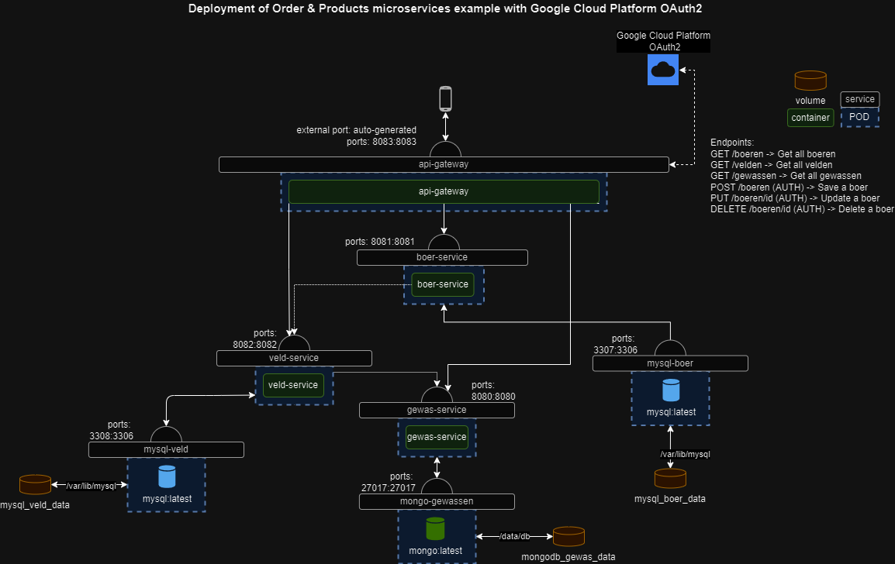

# APT Project

## Thema: Boer, veld en gewas management systeem

Met dit microservices project kan een boer zijn velden en gewassen beheren.
Een boer kan zijn welke velden hij allemaal heeeft en welke gewassen hier op staan.

#### Demon video: 

## Microservices:

| API Name      | Description                                                         | Database |
|---------------|---------------------------------------------------------------------|----------|
| boer-service  | Informatie over boeren                                              | MySQL    |
| gewas-service | Informatie over gewassen                                            | MongoDB  |
| veld-service  | Informatie over velden, de gewassen er op en van welke boer die is. | MySQL    |

## ERD diagram

## System diagram

## Endpoints:

Hier is een oplijsting van al de beschikbare endpoints

### 1. GET /boeren -> Get all boeren
### 2. GET /velden -> Get all velden
### 3. GET /gewassen -> Get all gewassen
### 4. GET /boeren/{uuid} -> Get 1 boer by uuid
### 5. GET /gewassen/{uuid} -> Get 1 gewas by uuid
### 6. POST /boeren (AUTH) -> Save a boer
### 7. PUT /boeren{uuid} (AUTH) -> Update a boer
### 8. DELETE /boeren/{uuid} (AUTH) -> Delete a boer
