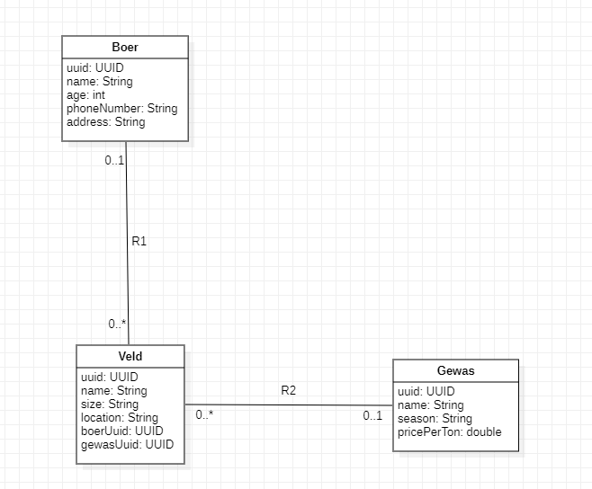

# APT Project

## Thema: Boer, veld en gewas management systeem

Met dit microservices project kan een boer zijn velden en gewassen beheren.

## Microservices:

| API Name      | Description                                                         | Database |
|---------------|---------------------------------------------------------------------|----------|
| boer-service  | Informatie over boeren                                              | MySQL    |
| gewas-service | Informatie over gewassen                                            | MongoDB  |
| veld-service  | Informatie over velden, de gewassen er op en van welke boer die is. | MySQL    |

## ERD diagram

## Endpoints:

Hier is een oplijsting van al de beschikbare endpoints

### 1. GET /boeren -> Get all boeren
### 3. GET /velden -> Get all velden
### 4. GET /gewassen -> Get all gewassen
### 2. GET /boeren/{uuid} -> Get 1 boer by uuid
### 2. GET /gewassen/{uuid} -> Get 1 gewas by uuid
### 5. POST /boeren -> Save a boer
### 6. PUT /boeren{uuid} -> Update a boer
### 6. DELETE /boeren/{uuid} -> Delete a boer
